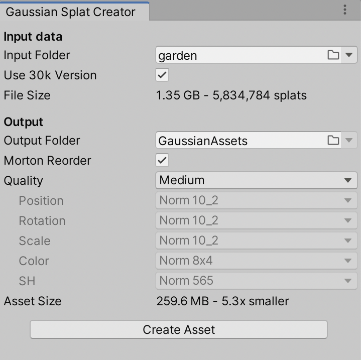

# Gaussian Splatting physic playground in Unity

This repository started as an experiment to better understand how physics works with Gaussian splatting in Unity, using [aras-p/UnityGaussianSpaltting](https://github.com/aras-p/UnityGaussianSplatting) as the base project.

The goal is not to recreate that work from scratch, but to use it as a starting point to study behavior, integration, and testing possibilities inside a Unity scene using already generated Gaussian Splat models.

This repository therefore explicitly builds on aras-p’s work and uses it as a technical foundation for experiments and verification of rendering and scene behavior with Gaussian splatting.

## Usage

Download or clone this repository, open `projects/GaussianExample` as a Unity project (I use Unity 2022.3, other versions might also work),
and open `GSTestScene` scene in there.

Note that the project requires DX12 or Vulkan on Windows, i.e. **DX11 will not work**. This is **not tested at all on mobile/web**, and probably
does not work there.

Next up, **create some GaussianSplat assets**: open `Tools -> Gaussian Splats -> Create GaussianSplatAsset` menu within Unity.
In the dialog, point `Input PLY/SPZ File` to your Gaussian Splat file. Currently two
file formats are supported:
- PLY format from the original 3DGS paper (in the official paper models, the correct files
  are under `point_cloud/iteration_*/point_cloud.ply`).
- [Scaniverse SPZ](https://scaniverse.com/spz) format.

Optionally there can be `cameras.json` next to it or somewhere in parent folders.

Pick desired compression options and output folder, and press "Create Asset" button. The compression even at "very low" quality setting is decently usable, e.g. 
this capture at Very Low preset is under 8MB of total size (click to see the video): \

If everything was fine, there should be a GaussianSplat asset that has several data files next to it.

Since the gaussian splat models are quite large, I have not included any in this Github repo. The original
[paper github page](https://github.com/graphdeco-inria/gaussian-splatting) has a a link to
[14GB zip](https://repo-sam.inria.fr/fungraph/3d-gaussian-splatting/datasets/pretrained/models.zip) of their models.

In the game object that has a `GaussianSplatRenderer` script, **point the Asset field to** one of your created assets.
There are various controls on the script to debug/visualize the data, as well as a slider to move game camera into one of asset's camera
locations.

The rendering takes game object transformation matrix into account; the official gaussian splat models seem to be all rotated by about
-160 degrees around X axis, and mirrored around Z axis, so in the sample scene the object has such a transform set up.

Additional documentation:

* [Render Pipeline Integration](/docs/render-pipeline-integration.md)
* [Editing Splats](/docs/splat-editing.md)

_That's it!_

### Physics proxy setup

For physics testing, I created mesh objects without Mesh Renderers and used them as simple physical bounding proxies to test ball collisions and bounces.

This setup was made specifically for the `garden` scene from the dataset zip. Since the Gaussian assets are not included in this repository, recreating the asset locally may introduce alignment differences, transform offsets, scaling mismatches, or other discrepancies, so these proxy bounding boxes might require adjustment.

The bounding boxes can be visualized by selecting the `PhysicsRoot_Proxy` object before entering Play mode, as shown in the screenshot.

### Physical Splat Behaviour

I realized a PhysicManager to controll physical behaviour of the scene splats.
In the Manager we can define all the aspects of the phenomenon we desire to implement. Then they can be used directly by the RenderGaussianSplats.shader where the logic is implemented.

In the video I implemented gusts of wind that move the leefs of the scene and show how the ball bounces on the objects.

https://github.com/user-attachments/assets/5c3367da-8594-4459-8be9-a5c944d010a6

## License and External Code Used

This repository is based on the work of [aras-p / UnityGaussianSplatting](https://github.com/aras-p/UnityGaussianSplatting), which is the main technical reference and starting point for this project.

The original upstream project by aras-p is released under the MIT license, and this repository should be considered in that context together with any local modifications or additions introduced here.

The project also inherits or reuses concepts, structure, and external components referenced by the original aras-p repository, including third-party code and integrations already documented upstream.

In particular, when reviewing external code usage and license compatibility, the first reference to check is the upstream project itself:
- [aras-p / UnityGaussianSplatting](https://github.com/aras-p/UnityGaussianSplatting)

It is also important to keep in mind that usage of Gaussian Splat assets can involve licensing conditions that are separate from this repository. In particular, the original Gaussian Splat training pipeline and related assets may be subject to the license terms of the official INRIA/GraphDeco implementation:
- [graphdeco-inria / gaussian-splatting license](https://github.com/graphdeco-inria/gaussian-splatting/blob/main/LICENSE.md)

So even if this repository or its Unity-side code is distributed under MIT-compatible terms, you should still verify the origin and license of the Gaussian Splat data, models, and any upstream components you use.
